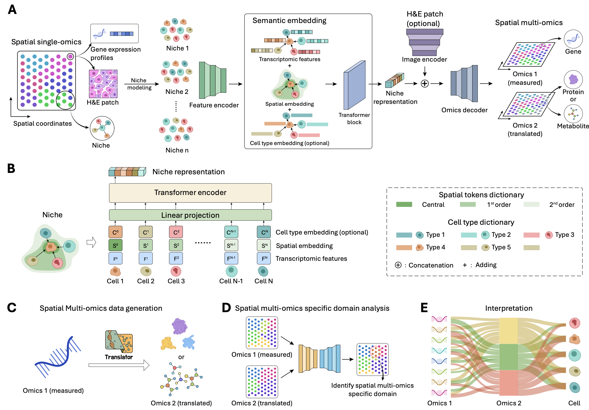

# NicheTrans: Spatial-aware Cross-omics Translation

This is the *official* Pytorch implementation of "NicheTrans: Spatial-aware Cross-omics Translation". 

## Pipeline




## Requirements

### Installation

```bash
pip install -r requirements.txt
(Here, we list some important packages crucial for model reproduction.）
```

### Prepare Datasets
Spatial Multimodal Analysis (SMA) dataset of Parkinson's Disease from ['Spatial multimodal analysis of transcriptomes and metabolomes in tissues'](https://www.nature.com/articles/s41587-023-01937-y). 

STARmap PLUS dataset of Alizimizer's Disease from ['Integrative in situ mapping of single-cell transcriptional states and tissue histopathology in a mouse model of Alzheimer’s disease'](https://www.nature.com/articles/s41593-022-01251-x).

Human breast cancer dataset from ['High resolution mapping of the tumor microenvironment using integrated single-cell, spatial and in situ analysis'](https://www.nature.com/articles/s41467-023-43458-x). 

Human lymph node dataset from ['Deciphering spatial domains from spatial multi-omics with SpatialGlue'](https://www.nature.com/articles/s41592-024-02316-4).

## Contact

If you have any questions, please don't hesitate to contact us. E-mail: [zhikang.wang@monash.edu](mailto:zhikang.wang@monash.edu).
